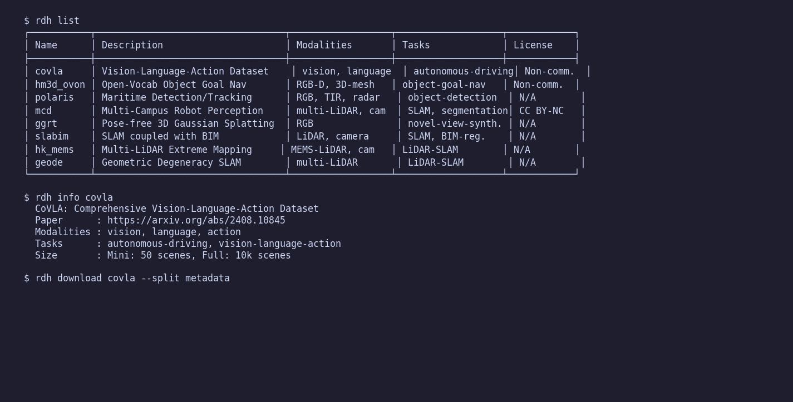
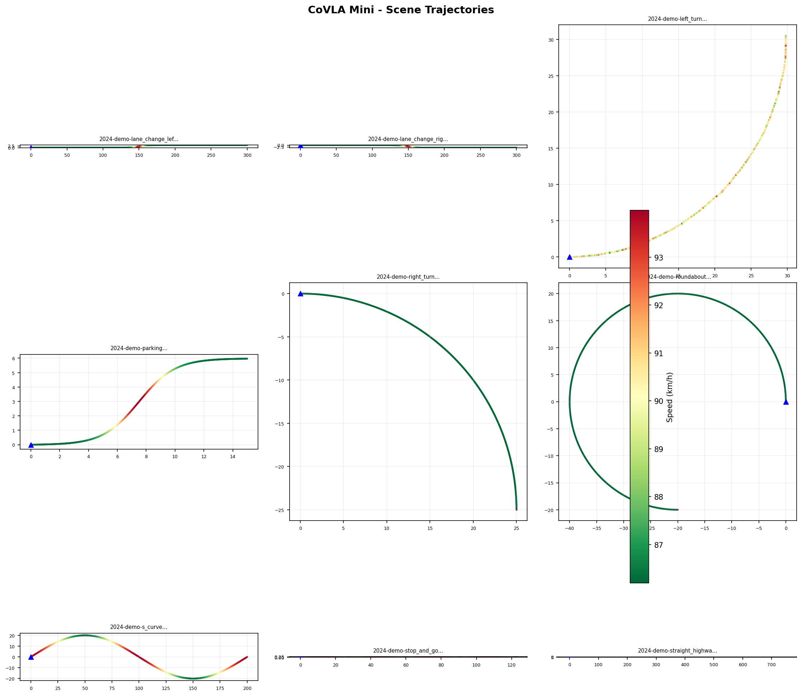
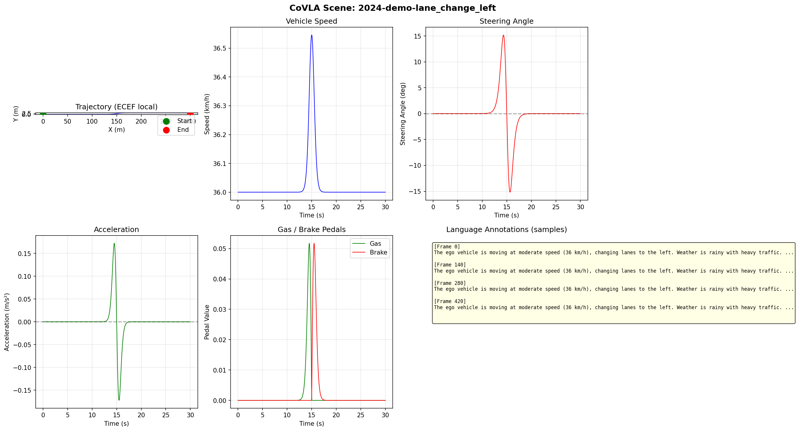
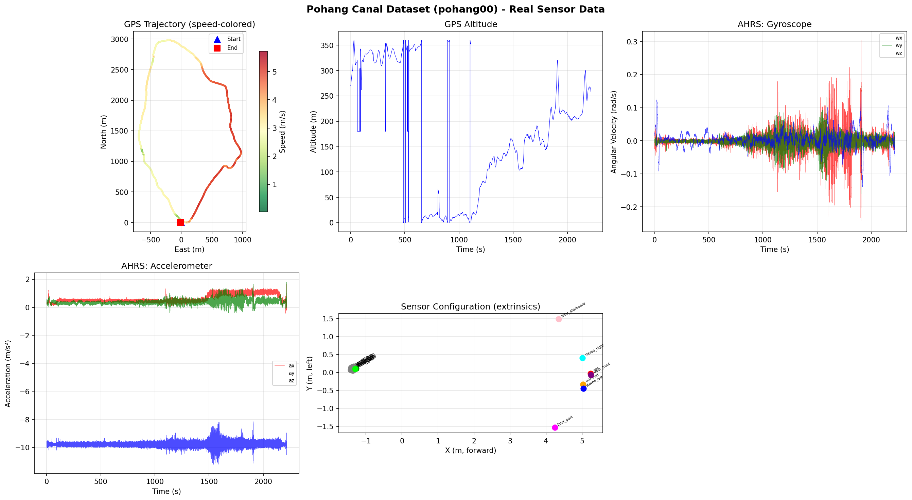
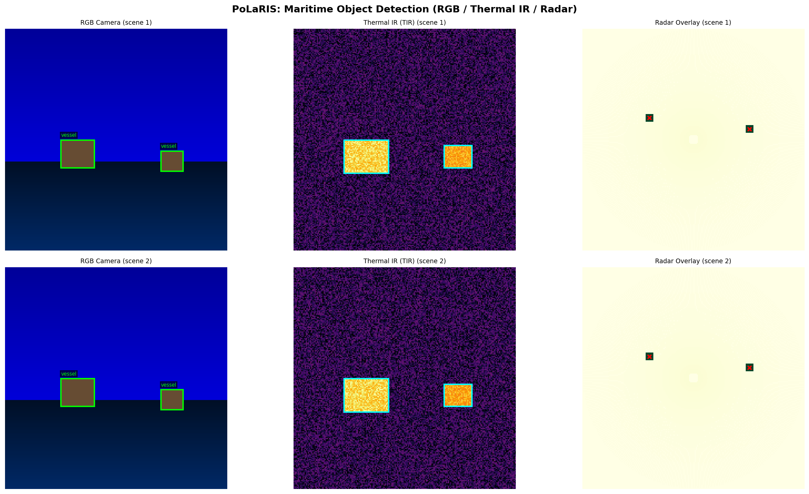
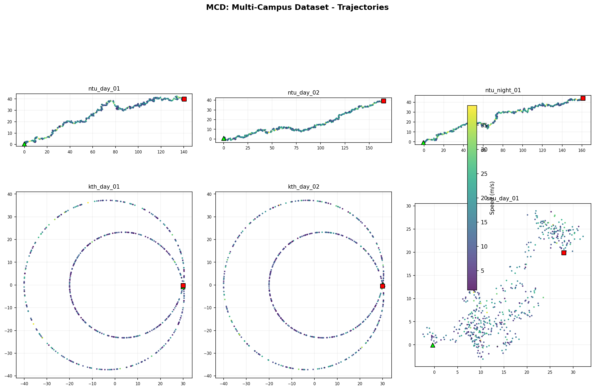
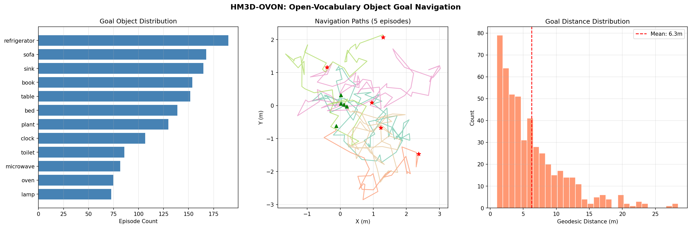
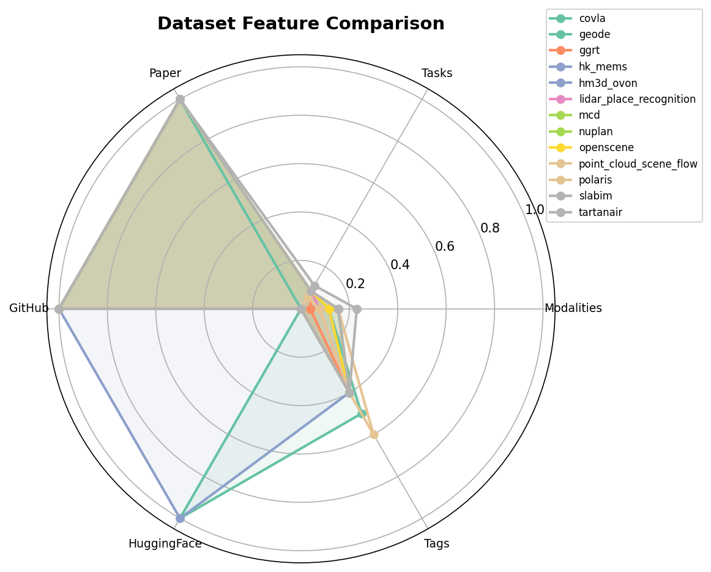
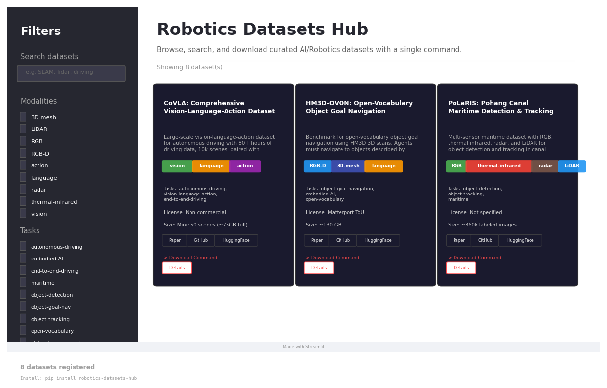

# robotics-datasets-hub

[](https://github.com/rsasaki0109/robotics-datasets-hub/actions/workflows/ci.yml)
[](https://www.python.org/)
[](LICENSE)
[](#supported-datasets--対応データセット)

**One-command download, convert, and visualize curated AI/Robotics datasets.**

AI/ロボティクス研究で使える厳選データセットを、1コマンドでダウンロード・可視化・デモ再生できるCLIツール。



## Table of Contents

- [Install](#install--インストール)
- [Quick Start](#quick-start--クイックスタート)
- [Demos](#demos)
- [Supported Datasets](#supported-datasets--対応データセット)
- [Compare Datasets](#compare-datasets--データセット比較)
- [Web Dashboard](#web-dashboard--ダッシュボード)
- [Jupyter Notebooks](#jupyter-notebooks)
- [Adding a Dataset](#adding-a-dataset--データセットの追加)
- [Development](#development--開発)

## Install / インストール

```bash
pip install -e .
```

Optional extras:
```bash
pip install -e ".[viz3d]"       # 3D visualization (Open3D, Plotly)
pip install -e ".[dashboard]"   # Streamlit web dashboard
```

## Quick Start / クイックスタート

```bash
# List all datasets / データセット一覧
rdh list

# Search datasets / 検索
rdh list navigation

# Show dataset details / 詳細表示
rdh info covla

# Download a dataset / ダウンロード
rdh download covla --split metadata --output ./data/

# Download real maritime data (no auth needed) / 実データDL
rdh download polaris --split nav-only --output ./data/

# Dataset-specific demo visualization / データセット固有デモ
rdh demo covla --data-dir ./data/
rdh demo polaris --data-dir ./data/polaris

# Compare datasets / データセット比較
rdh compare --save comparison.png

# Web dashboard / ダッシュボード
rdh dashboard
```

## Demos

### CoVLA: Vision-Language-Action (Autonomous Driving)

Multi-scene trajectory overview with speed colormap:



Single scene detail — trajectory, speed, steering, acceleration, pedals, language annotations:



### Pohang Canal: Real Maritime Sensor Data

**Real data** from AWS S3 (no authentication required, 21MB):



### PoLaRIS: Multi-Sensor Maritime Detection



### MCD: Multi-Campus Trajectories



### HM3D-OVON: Navigation Episodes



## Supported Datasets / 対応データセット

| Name | Task | Modalities | Paper |
|------|------|------------|-------|
| **CoVLA** | Autonomous Driving VLA | Vision, Language, Action | [arXiv:2408.10845](https://arxiv.org/abs/2408.10845) |
| **HM3D-OVON** | Open-Vocab Object Goal Nav | RGB-D, 3D mesh, Language | [arXiv:2409.14296](https://arxiv.org/abs/2409.14296) |
| **PoLaRIS** | Maritime Detection/Tracking | RGB, TIR, Radar, LiDAR | [arXiv:2412.06192](https://arxiv.org/abs/2412.06192) |
| **MCD** | Multi-modal SLAM | Multi-LiDAR, Camera, IMU, UWB | [arXiv:2403.11496](https://arxiv.org/abs/2403.11496) |
| **GGRt** | Pose-free 3D Gaussian Splatting | RGB | [arXiv:2403.10147](https://arxiv.org/abs/2403.10147) |
| **SLABIM** | SLAM + BIM | LiDAR, Camera, IMU, BIM | [arXiv:2502.16856](https://arxiv.org/abs/2502.16856) |
| **HK_MEMS** | LiDAR SLAM (Extreme) | MEMS LiDAR, Camera, GNSS, INS | [JFR](https://onlinelibrary.wiley.com/doi/10.1002/rob.70136) |
| **GEODE** | LiDAR SLAM (Degeneracy) | Multi-LiDAR, Stereo, IMU | [arXiv:2409.04961](https://arxiv.org/abs/2409.04961) |
| **TartanAir V2** | Visual SLAM / Robot Learning | Stereo RGB, Depth, LiDAR, IMU | [arXiv:2306.06644](https://arxiv.org/abs/2306.06644) |
| **nuPlan** | Motion Planning | LiDAR, Camera, HD Map | [arXiv:2106.11810](https://arxiv.org/abs/2106.11810) |
| **OpenScene** | Open-Vocab 3D Segmentation | 3D Point Cloud, RGB, Language | [arXiv:2211.15654](https://arxiv.org/abs/2211.15654) |
| **Awesome LiDAR Place Recognition** | Place Recognition Survey | LiDAR, Point Cloud | [GitHub](https://github.com/hogyun2/awesome-lidar-place-recognition) |
| **Awesome Point Cloud Scene Flow** | Scene Flow Survey | Point Cloud, LiDAR | [GitHub](https://github.com/MaxChanger/awesome-point-cloud-scene-flow) |

## Compare Datasets / データセット比較

```bash
rdh compare                              # all datasets
rdh compare covla,polaris,mcd            # specific datasets
rdh compare --save comparison.png        # save chart
```



## Web Dashboard / ダッシュボード

```bash
pip install -e ".[dashboard]"
rdh dashboard
```



ブラウザでデータセットの検索・フィルタリング・詳細閲覧ができます。

## Jupyter Notebooks

| Notebook | Description |
|----------|-------------|
| `notebooks/01_quickstart.ipynb` | データセットの探索・検索・一覧表示 |
| `notebooks/02_polaris_real_data.ipynb` | Pohang Canal 実データのDL→可視化 |

## Adding a Dataset / データセットの追加

`registry/` にYAMLファイルを追加するだけ:

```yaml
name: my_dataset
display_name: "My Dataset"
description: "Description of the dataset"
paper_url: "https://arxiv.org/abs/..."
project_url: "https://..."
github_url: "https://github.com/..."
huggingface_id: ""
modalities: [RGB, LiDAR]
tasks: [SLAM]
license: "CC BY 4.0"
size_hint: "10GB"
tags: [outdoor]
download:
  method: huggingface  # or: gdown, wget, git, s3
  url: "org/dataset-name"
```

## Development / 開発

```bash
pip install -e ".[dev]"
ruff check src/ tests/
pytest tests/ -v
```

## Citations / 引用

各データセットの論文を引用してください。詳細は `rdh info <dataset_name>` で確認できます。

## License

Apache License 2.0
